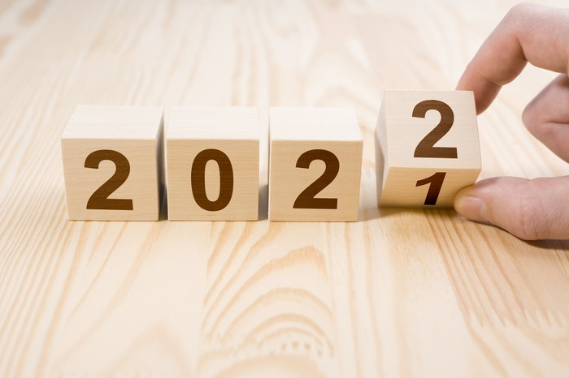

source : [https://Gambar_source](https://awsimages.detik.net.id/community/media/visual/2021/09/23/kalender-2022.jpeg?w=700&q=90)

# Resolution 2022

---

## MySelf

- Learn time management
- Learn to be Team Leader
- Learn public speaking
- Learn English (speak, writing, listening, reading) and also grammar
- Learn tools for project management, example : ClickUp or Asana

---

## Productivity

- Become an Expert Full-stack Developer
    

    
Back-End Developer

    ⋅⋅* Laravel coming soon version 9 LTS and ecosystem, I will build clean code and TDD implementation
    * Codeigniter v4 implementation HMVC
    * Golang as the main weapon later
    
    
    
    

    
Front-End Developer

    - Vuejs v3 for implementation in Dashboard Admin
    

    
    

     
 Mobile Developer 

    - I'm very interested in a flutter
    

    Learning for Documentation Application
        
- UI or UX Designer
- Learning installation Linux and All Distro Linux
- Social media Marketing
- Learn Quantity Engineering and all tools
- Become a DevOps

---

## **Conclusion**

I'm very disappointed with what I did this year but I'm also grateful to have added insight. Then the hopefully next year 2022 will be even better.
Keep Learning and Developing.

**Dafrin - 2021**

---

### **Social Media**

[mail](masapin68@gmail.com) - [Instagram](https://instagram.com/fdm_0301) - [Facebook](https://www.facebook.com/dafrin.maulana.98/)